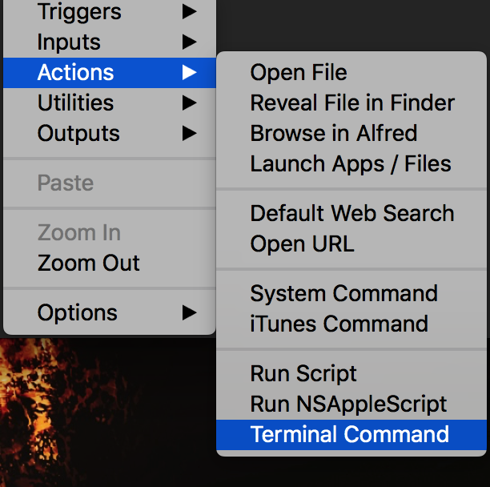

## workflow

之前也一直使用被称为mac神器到alfred。直到今天才发现我用的是低版本，功能非常基础。而高版本所支持的workflow才是真的称为神器。。workflow就是让alfred直接执行脚本，包括shell、python、php等。

写了两个例子

#### 登录校园网（使用python脚本）

在之前用旧版本的alfred登录校园网所用的方法是在feature添加web url，输入p打开p.nju.edu.cn。然后点击输入浏览器记住的密码登陆。相比打开浏览器页面已经快捷很多。但是如果使用workflow可以直接，输入指定内容，回车就可以登陆。具体定义该workflow的步骤如下：

1. preference中点击workflow,按照如图选择keyword to script

	
	
2. 输入关键字和描述，保存

	

3. 右键创建script

	

4. 输入执行的脚本并保存

```python
# -*- coding:utf-8 -*-

import json
import urllib
import urllib2


def login():
    url = 'http://p.nju.edu.cn/portal_io/login'
    username = 'xxxx'  # 可将密码等保存至文件
    password = 'xxxxx'
    data = {'username': username, 'password': password}
    postdata = urllib.urlencode(data).encode('utf-8')
    try:
        request = urllib2.Request(url, postdata)
        response = urllib2.urlopen(request)
        res = json.loads(response.read().decode('utf-8'))
        # print res["reply_code"]
    except Exception as e:
        print(e)
        
        
if __name__ == '__main__':
    login()
```
快捷键打开alfred输入框，输入你的关键字，回车。就连上了校园网，简直方便到爆。

#### 部署hexo博客（使用shell脚本）

一般部署hexo博客要输入三条命令`hexo clean` `hexo g` `hexo d`。每次都要打开终端输入三个命令真的很麻烦，进阶方法是将命令写成shell脚本，打开终端执行./xxx.sh。当然也可以利用alfred，连终端都不用自己打开。

1 2 3步骤和上个例子一样，不过第四步选择terminal command



然后输入脚本

```
cd 你的博客本地目录 && hexo clean && hexo g && hexo d
```
	
写完博客，快捷键打开alfred输入框，输入你定义的关键字，回车。部署完成。
同理也可以将博客创建的几条命令放在shell脚本用workflow打开。


### 问题
照理说命令应该选择script，但是不奏效，debug（workflow页面有个小虫子，就是debug）发现找不到hexo命令（我明明安装的是全局hexo命令）。所以选择terminal command。找到原因了再来改

最后alfred是真神器。
	

