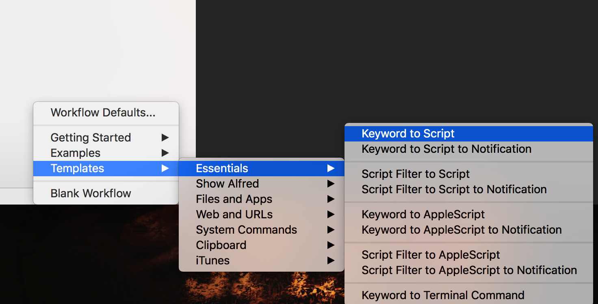
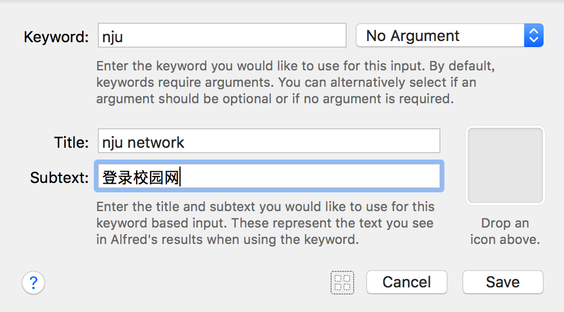
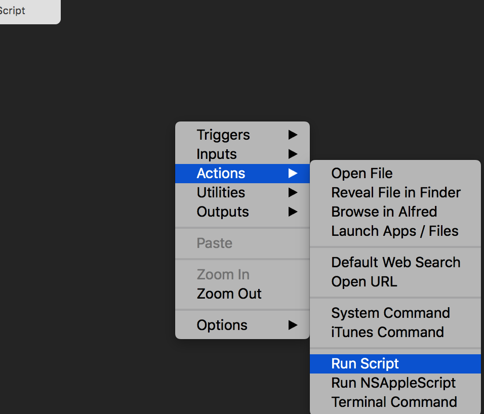

## workflow登录校园网

在之前用旧版本的alfred登录校园网所用的方法是在feature添加web url，输入p打开p.nju.edu.cn。然后点击输入浏览器记住的密码登陆。但是如果使用workflow**直接快捷键‘opt+p’可以登录校园网，登录成功后有提示音和notification；‘opt+o’可以退出登录校园网，退出成功后有提示音和notification；** 步骤如下：

1. preference中点击workflow,按照如图选择keyword to script

	
	
2. 输入关键字和描述，保存

	

3. 右键创建script

	

4. 输入执行的脚本并保存

```python
# -*- coding:utf-8 -*-

import json
import urllib
import urllib2


def login():
    url = 'http://p.nju.edu.cn/portal_io/login'
    username = 'xxxx'  # 可将密码等保存至文件
    password = 'xxxxx'
    data = {'username': username, 'password': password}
    postdata = urllib.urlencode(data).encode('utf-8')
    try:
        request = urllib2.Request(url, postdata)
        response = urllib2.urlopen(request)
        res = json.loads(response.read().decode('utf-8'))
        # print res["reply_code"]
    except Exception as e:
        print(e)
        
        
if __name__ == '__main__':
    login()
```
快捷键打开alfred输入框，输入你的关键字，回车。就连上了校园网，很方便。


#### 更简单的方式：下载.alfredworkflow文件

1. 下载NJUnet.alfredworkflow文件
2. 双击下载的文件
3. 双击这两个脚本 按提示输入自己的账号密码


---

## workflow让github变成最快捷的图床

写markdown的都知道，图片需要url，如果需要本地一张图片显示要先上传，获取url，这就显得麻烦。能不能有个软件，选中图片，按个快捷键，就可以上传图片拿到图片的url呢？ **workflow可以做到。** 
	
步骤如下：

1. 新建如下工作流。可根据自己需要更改。需要注意的是hotkey里`argument`选择`selection in macOS`,快捷键可以自己定义

	

2. 编写shell脚本

	```shell
	#!/bin/bash
	t=$(date +%s)
	cp '{query}' /Users/Mark.W/Documents/AboutMyself/picBed/Screenshot${t}.png
	cd /Users/Mark.W/Documents/AboutMyself/ 
	git add . > /dev/null
	git commit -m add_upload_picture_${t} > /dev/null
	git push origin master > /dev/null
	echo http://raw.githubusercontent.com/IMWYY/AboutMyself/master/picBed/Screenshot${t}.png
	```

	这里{query}是选中文件的路径，先将其拷贝至git本地仓库，然后再用git命令提交即可。这里有几个注意点：
	1. {query}要加上引号，以防遇到文件名里有空格，cp命令会将其拆分当成命令参数。
	2. git命令都有命令回显，而我需要到clipboard的内容只需要是图片url，为了防止干扰，命令后加上`> /dev/null`回显信息定位到“黑洞”。
	3. git上图片链接地址需要加上`raw`。我这里用的仓库是`AboutMyself`。
	4. 使用git命令需要配置好git本地的一些参数，ssh key，账号密码之类

#### 更简单的方式：下载.alfredworkflow文件

1. 下载picBed.alfredworkflow文件
2. 双击下载的文件
3. 双击shell个脚本,按自己的情况修改一下

这样既可以方便写markdown，还能让你的github经常提交变得绿油油。。岂不美滋滋